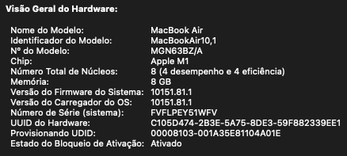
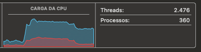
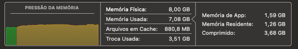
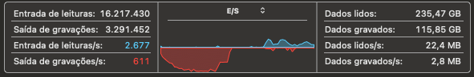

# PÓS TECH - Restaurante

## Descritivo do sistema

Nosso serviço de reservas online conta com 3 fluxos
1. Cadastro de restaurante
2. Reservas
3. Avaliações

Nesse arquivo estará contido o fluxo para utiliza-los.

## Premissas do sistema

Nossas reservas são apenas de hora em hora (13:00 / 14:00), não trabalhamos com horas quebradas por exemplo 13:15 / 14:40.
Caso seja informado um horario quebrado, irá retornar uma mensagem de erro informando que não existe assento para a hora selecionada.

## Features do sistema

### Cadastro de restaurantes

#### Cadastrar novo restaurante

Para iniciar a utilização do sistema, será necessário cadastrar o restaurante. 
Esse cadastro será efetuado pela rota POST /restaurant, a documentação deste endpoint pode ser acessada [aqui](http://localhost:8080/swagger-ui/index.html#/restaurant-controller/createRestaurant)

#### Atualizar restaurante existente

Após o cadastro, caso necessário poderemos atualizar o registro utilizando o endpoint PUT /restaurant/edit/{id}, a documetanção deste endpoint pode ser acessada [aqui](http://localhost:8080/swagger-ui/index.html#/restaurant-controller/editRestaurant)

#### Consultar restaurante existente por id

Para obter os dados de cadastro do restaurante, pode-se utilizar o endpoint GET /restaurant/get/{id}. Sua documentação está [aqui](http://localhost:8080/swagger-ui/index.html#/restaurant-controller/getRestaurant)

#### Consultar todos os restaurantes cadastrados

Para obter uma lista com todos os restaurantes cadastrados, utiliza-se o endpoint GET /restaurant/get. Cuja documentação está [aqui](http://localhost:8080/swagger-ui/index.html#/restaurant-controller/findRestaurants).
**Atenção, essa consulta é case sensitive**.

#### Deletar restaurante por id

Caso o restaurante pare de utilizar o sistema, é possível deletar o seu registro através do endpoint DELETE /restaurant/{id}, acesse [aqui](http://localhost:8080/swagger-ui/index.html#/restaurant-controller/deleteRestaurant) para ver a sua documentação.

### Reservas

#### Processamento das disponibilidades

Nossa aplicação possui um scheduler que roda todos os dias durante a madrugada para realizar o processamento das disponibilidades dos restaurantes para o dia seguinte. Caso seja necessário, é possível reealizar esse processamento manualmente através do endpoint POST /availability que possui a documentação [aqui](http://localhost:8080/swagger-ui/index.html#/available-controller/process).

#### Consultar disponibilidade do restaurante

Para consultar a disponibilidade do restaurante, é necessário utilizar o endpoint GET /availability, sua documentação está disponível [aqui](http://localhost:8080/swagger-ui/index.html#/available-controller/findAvailability).

#### Cadastrar um nova reserva

Para cadastrar uma nova reserva, o endpoint que deve é POST /available/reserve_request. Veja sua documentação [aqui](http://localhost:8080/swagger-ui/index.html#/reservation-controller/createReservation)

#### Alteração de reserva

Caso haja necessidade de alterar a reserva, deve-se chamar o endpoint PUT /available/reserve_request/edit/{id}. Sua documentação está [aqui](http://localhost:8080/swagger-ui/index.html#/reservation-controller/updateReservation)

#### Cancelar reserva

Para cancelar uma reserva, o endpoint é DELETE /available/reserve_request/cancel/{id}. A documentação pode ser acessada [aqui](http://localhost:8080/swagger-ui/index.html#/reservation-controller/cancelReservation)

#### Consultar reservas

A consulta da reserva, pode ser feita por:
1. Id -> documentação [aqui](http://localhost:8080/swagger-ui/index.html#/reservation-controller/findReservationById)
2. Filtros (idRestaurante, status, data e hora) -> documentação [aqui](http://localhost:8080/swagger-ui/index.html#/reservation-controller/findReservations)

#### Concluir a reserva

Este endpoint serve para concluir a reserva, quando o cliente está no restaurante, liberando assim a funcionalidade de avaliação. Sua documentação pode ser encontrada [aqui](http://localhost:8080/swagger-ui/index.html#/reservation-controller/completeReservation)

### Avaliação

#### Enviar avaliação

A avaliação de uma reserva COMPLETA poderá ser realizada uma unica vez, sem a possibilidade de edição. Essa avaliação será realizada no endpoint POST \evaluation\create, caso necessário sua documentação pode ser acessada [aqui](http://localhost:8080/swagger-ui/index.html#/evaluation-controller/createEvaluation)

#### Consultar avaliação

As avaliações podem ser consultadas por reserva ou por restaurante, no endpoint GET evaluation/get. Sua documentação pode ser vista [aqui](http://localhost:8080/swagger-ui/index.html#/evaluation-controller/findReservations)

## Qualidade de Código

Utilizamos o spring-javaformat para garantir a homogeneidade do código (espaçamento, quebra de linha, tamanho de linha, etc). A documentação do plugin pode ser acessada [aqui](https://github.com/spring-io/spring-javaformat)

Para a validação basta executar a tarefa validate do maven e caso deseje corrigir automaticamente o código criado, pode-se utilizar o comando `./mvnw spring-javaformat:apply`

## Testes

Nossa aplicação conta com testes integrados, unitários e de performance. Os testes podem ser validados abaixo:

### Testes de integração

Estão no package /src/test/resources, eles testam o fluxo end to end da aplicação, nos cenários criticos. Utilizamos o cucumber para fazer os BDD tests.
Seu banco de dados em memória permite que a execução simule exatamente o contexto de produção.

### Testes unitários

Os testes unitários, estão no package /src/test, eles possuem cobertura minima de testes validada pelo JaCoCo. Para visualizar o relatório do JaCoCo deve-se executar o comando mvn clean install no terminal e após a execução o relatório estará disponível em target/site/jacoco/index.html

### Testes de performance

Os testes de performance estão no package /jMeter podendo ser executado a qualquer momento. Abaixo a execução em uma máquina de desenvolvimento com as seguintes caracteristicas:

Houve um pico de processamento pois a nossa aplicação é uma aplicação basicamente de I/O no Banco de Dados.

A memória ficou estável, pois é muito pouco utilizada e quase não há validações e criações de variaveis em memória

Houve um aumento na latencia de gravação pois tivemos uma sobrecarga no sistema que gerou 124671 novos registros e consultou 127764 vezes a base de dados simultaneamente

## Utilizando o app

## Docker - Local

Para executar a aplicação basta utilizar os comandos na raiz do projeto

`docker build -t restaurante-tech .`

`docker run -p 8080:8080 restaurante-tech`

## AWS

O endpoint na aws é http://restaurante-loadbalancer-1926931993.us-east-1.elb.amazonaws.com/ ela está em um ECS com um LoadBalancer para fazer o gerenciamento de acesso nos pods

## Heroku

O endpoint na cloud Heroku é https://restaurante-tech-app-418f9f753f18.herokuapp.com/ e seu deploy acontece sempre que há uma alteração na main